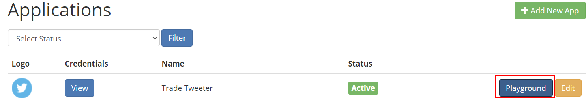
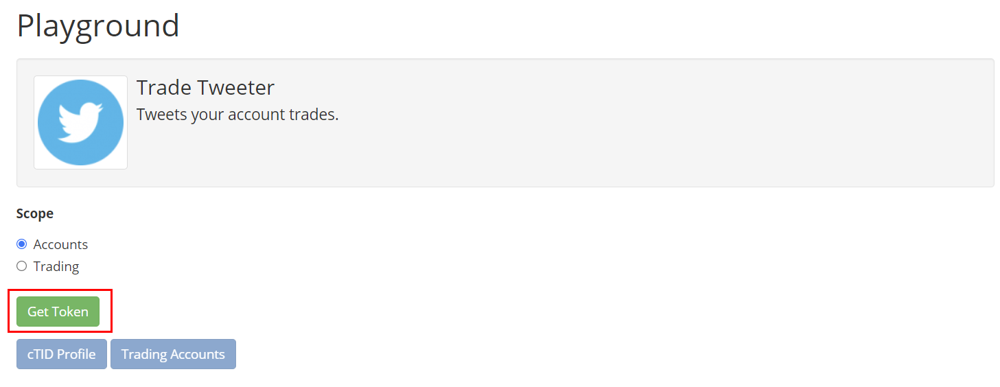
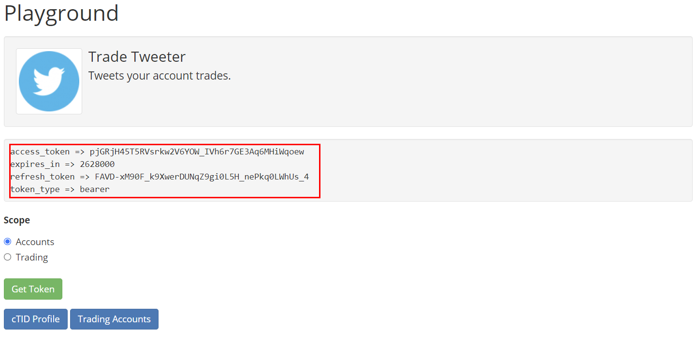
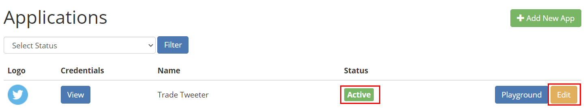
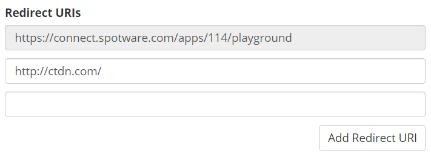

# Account Authentication

Spotware Open API authentication process is designed based on OAuth 2.0. 

The OAuth 2.0 authorization framework allows the third-party applications obtaining limited access to the service, either on behalf of a resource owner by orchestrating an approval interaction between the resource owner and the service, or by allowing the third-party application to obtain access on its own behalf.

The communication with the resource (e.g. trading account) owner looks as follows:

1. A trading account owner decides to start using your service by clicking some action button on your site.

2. The service generates a request to the Open API 2.0, redirecting the trader to the Spotware side.

3. Trader logs in using his personal cTrader profile and allows permissions.

4. After that, the trader is redirected back to the service side with an authentication code which can be exchanged with an access token. The access token allows the service to perform operations with the trading account on behalf of the trader.

## Playground

To experiment with API authorization process you can use the playground option of your API application.

For accessing playground go to your Open API applications page, click on an application playground button:



Playground allows you to easily get an access token for one of your Open API applications, once you are in your application playground page click on "Get Token" button:



It will send you to account authentication page for your own logged in cTrader ID, select some of your connected trading accounts for authorization and click on "Allow Access" button.

You will be redirected back to playground page but this time it will show you the access token data:



You can use that access token for sending/receiving messages to the API.

## Authorization

In order to obtain access to a trading account’s information and trade on its behalf, you should have an authentication token for each cTrader ID that uses your application.

cTrader give each user a cID, and all of the trading accounts of that user from all brokers will be linked to that cID, and Open API uses cID to give you access to some or all of a user linked trading accounts based on the user given permission.

First you must have an active Open API application, your API application status on your applications page must be "Active", then add a redirect URL to your API application, the API will redirect the user to this URL after account authorization and it will pass the access code as a URL parameter.

### Adding Redirect URI

Open your applications page, and click on your application "Edit" button:



In your application edit page, scroll down and find the "Redirect URIs" section:



As you can see your application can have as many redirect URI as it needed, and you can a new one by clicking on "Add Redirect URI" button.

The first redirect URI is for playground, you can't remove or change it, and you must not use it on your products.

Once you added the "Redirect URIs" click on "Save" and that's it.

### Getting Authorization Code

Now you are ready to get an authentication code from a cTrader user, URI:

```
https://connect.spotware.com/apps/auth?client_id={your_app_client_id}&redirect_uri={redirect_uri}&scope=accounts
```

Example:

```
https://connect.spotware.com/apps/auth?client_id=7_5az7pj935owsss8kgokcco84wc8osk0g0gksow0ow4s4ocwwgc&redirect_uri=http%3A%2F%2Fwww.spotware.com%2F&scope=accounts
```

You have to replace the "your_app_client_id" with your Open API application client ID and "redirect_uri" with one of your application redirect URIs.

After you filled the authentication URI with your app credentials open it and you will see the cTrader ID login page.

Login to a cTrader ID with some trading account, after logging in you will see the cTrader ID trading accounts list, with a check box for authorizing access to that trading account.

Click on "Allow Access" button, you will be redirected to your application redirect URI and the Authorization Code will be appended as a parameter to the redirect URI:

```
https://my-redirect-uri.com/?code={authorization_code-code-will-be-here}
```

Get the authorization code from redirect URI and generate an access token from it.

The authorization code has a one minute expiry time, you must exchange it with an access token as soon as possible otherwise it will be invalidated.

### Getting Access Token

To exchange an authorization code with an access token you have to send the authorization code to this URI:

```
https://connect.spotware.com/apps/token?grant_type=authorization_code&code={authorization_code}&redirect_uri={redirect_uri}&client_id={your_app_client_id}&client_secret={your_app_client_secret}
``` 

Example:

```
https://connect.spotware.com/apps/token?grant_type=authorization_code&code={authorization_code}&redirect_uri=http%3A%2F%2Fwww.spotware.com%2F&client_id=7_5az7pj935owsss8kgokcco84wc8osk0g0gksow0ow4s4ocwwgc&client_secret=49p1ynqfy7c4sw84gwoogwwsk8cocg8ow8gc8o80c0ws448cs4

```

It will return back an access token in JSON, the response will have this properties:

```
* accessToken
* refreshToken
* expiresIn
* tokenType
* errorCode
* description
```
Example:

```json
{
	"accessToken":"mos8Bw3D4EG0fRPd4Eqq0JxaFT4zjd8e4YijNezh_ag",
	"tokenType":"bearer",
	"expiresIn":2628000,
	"refreshToken":"VCuafFhy81AFZjsWkbuEzdOhhRj5YTWz8fWUwHam7KM",
	"errorCode":null,
	"access_token":"mos8Bw3D4EG0fRPd4Eqq0JxaFT4zjd8e4YijNezh_ag",
	"refresh_token":"VCuafFhy81AFZjsWkbuEzdOhhRj5YTWz8fWUwHam7KM",
	"expires_in":2628000
}
```

The above token will expire after 2628000 seconds from now, the expiry is in seconds which starts from the time you got the token.

Once your token expired you can use the refresh token to get a new access token.

### Refreshing Access Token

The access tokens have expiry time, once a token reached its expiry you will not be able to use that token anymore, and you have to refresh the expired token.

The refresh token never expires and each access token has a refresh token.

To refresh your access token you have to send the refresh token to:

```
https://connect.spotware.com/apps/token?grant_type=refresh_token&refresh_token={refresh_token}&client_id={your_app_client_id}&client_secret={your_app_client_secret}
```

It will give you back a new generated token with a new refresh token, now you can use this new token data instead of the old one which is invalidated.

But for testing our Open API while skipping the authentication flow, you can follow the steps described in the Playground section. This authentication token will be requested for our test application "Test Partner" registered in demo connect site.

Select your application from the Applications section and click Playground next to it. Select the scope you need - Trading or Accounts - and click Get Token.

### Notes

1. If you are not aware of what cTrader ID is, why you need this and how it works, please check the corresponding section below. Because you have to have it to play with OAuth services.

2. If you are not aware of OAuth technology, please check the OAuth standard reference RFC6749: The OAuth 2.0 Authorization Framework.